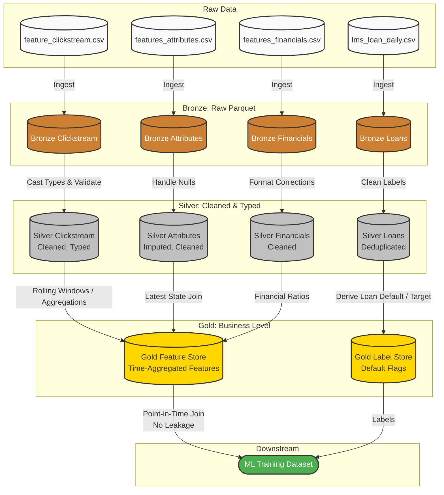

# ETL Architecture for Assignment 1

The proposed data pipeline follows the **Medallion Architecture (Bronze -> Silver -> Gold)**, ensuring separation of concerns, data quality, and reusability. It is designed to be compatible with a downstream binary classification ML model while carefully avoiding data leakage.

## Architecture Diagram

## Layer Definitions

1. **Bronze Layer:** Ingest raw CSVs as Parquet files with minimal transformations. This provides a resilient and typed historical archive of the raw data.
2. **Silver Layer:** Apply data cleaning rules. Standardize formats, resolve missing values where appropriate, drop explicit duplicates, and prepare individual entities before feature construction.
3. **Gold Layer:** Perform business-level aggregations and feature engineering. Calculate variables such as `last_30_days_clicks` or `debt_to_income_ratio`.
   * **Important:** Strict point-in-time constraints must be enforced during these joins and aggregations to prevent **Data Leakage** (i.e. we cannot use data that would only be available *after* the loan's outcome is decided).
