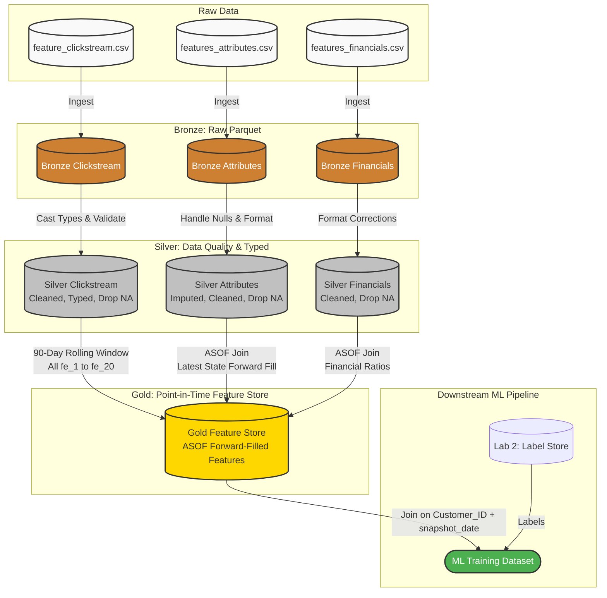

# ETL Architecture for Assignment 1 (v2.0)

This architecture updates v1.0 by implementing robust "As-Of" (ASOF) Point-in-Time joins. It ensures that features from disparate update cadences (daily clickstream vs. monthly financials) are safely merged without causing Data Leakage or NULL dropping.

## Architecture Diagram

