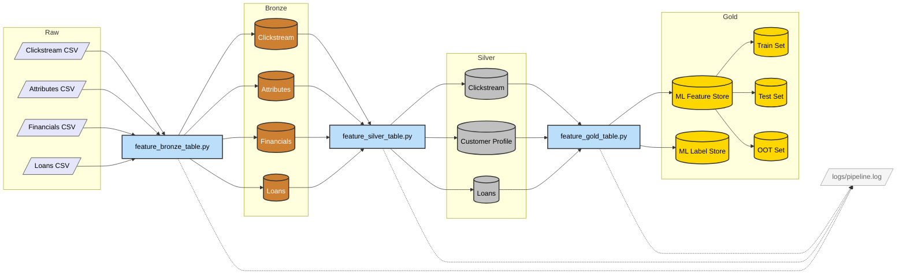

# Pipeline Architecture v3.0 — Medallion Architecture

> Source of truth: [Databricks — What is Medallion Architecture?](https://www.databricks.com/glossary/medallion-architecture)

## Mermaid Diagram

Copy the code block below and paste it into [mermaid.live](https://mermaid.live) to render.

## Layer Definitions (per Databricks)

| Layer | Purpose (Databricks) | What Our Code Does (`*.py`) | Our Processing Steps | Anomalies & Logging |
|-------|---------------------|---------------------------|----------------------|---------------------|
| **Bronze** | Land raw data "as-is" with metadata (load date, process ID) | `feature_bronze_table.py` loops through a dictionary of 4 CSV paths. For each file, it reads with `inferSchema=False` (preserves raw strings), adds an `ingestion_timestamp` metadata column, and writes to Parquet. No cleaning, no type casting — raw data preserved exactly as received. | ✅ Read 4 CSVs (Clickstream, Attributes, Financials, Loans) | ✅ `ingestion_timestamp` added to every row |
| | | | ✅ Add `ingestion_timestamp` column | ✅ Row counts logged per table |
| | | | ✅ Write to Parquet (no schema changes) | 🔲 *Backlog: Schema drift detection* |
| **Silver** | Cleanse, conform, deduplicate — "Enterprise view" of key business entities | `feature_silver_table.py` applies "just-enough" transformations. **Consolidation Decision:** Cleaned demographics (Attributes) and credit info (Financials) share a 1-to-1 relationship on `(Customer_ID, snapshot_date)` and contain exactly 12,500 records. We merge them via `INNER JOIN` into `silver_customer_profile.parquet` to simplify down-stream queries and reduce data duplication. | ✅ Cast `Age` to int, regex-strip garbage chars | ✅ **Age**: 988/12500 (7.9%) — `WARNING` |
| | | | ✅ Median-fill Age outliers (outside 18–100) | ✅ **Num_of_Loan**: 563/12500 (4.5%) — `INFO` |
| | | | ✅ Median-fill Num_of_Loan outliers (outside 0–50) | ✅ **Annual_Income**: Winsorized at P99 |
| | | | ✅ Winsorize Annual_Income at 99th percentile | ✅ Threshold alerting: <1% INFO, >5% WARNING, >20% CRITICAL |
| | | | ✅ Regex-clean all financial numeric columns | 🔲 *Backlog: Monthly_Balance has -3.3×10²⁵ outlier* |
| | | | ✅ Cast `loan_start_date`, `snapshot_date` to Date | 🔲 *Backlog: Credit_Mix has 2,611 garbage `_` values (20.9%)* |
| | | | ✅ Deduplicate by `Customer_ID` + `snapshot_date` | 🔲 *Backlog: Payment_Behaviour has 998 `!@9#%8` values (8.0%)* |
| | | | | 🔲 *Backlog: Interest_Rate max=5,789% — cap at 100* |
| **Gold** | Curated, consumption-ready, business-level aggregates and features | `feature_gold_table.py` uses the **Loans** table as the anchor spine (137,500 loan events). For each loan snapshot, it performs ASOF (point-in-time) forward-fill joins to pull the latest available Customer Profile (merged Demographics + Financials) without looking into the future. For Clickstream, it computes 90-day rolling `sum` and `avg` windows for all 20 `fe_` features. Finally, it derives `Debt_to_Income`, fills missing clickstream with 0, and adds a `dataset_split` temporal indicator (Train/OOT split). | ✅ Loans table as anchor spine (137,500 events) | ✅ Gold row count logged |
| | | | ✅ ASOF join: forward-fill Customer Profile to loan dates | ✅ Zero data leakage guaranteed (point-in-time) |
| | | | ✅ 90-day rolling window for Clickstream (sum + avg, fe_1–fe_20) | ✅ dataset_split Train/OOT split (cutoff: 2025-05-01) |
| | | | ✅ Derived feature: `Debt_to_Income` ratio | 🔲 *Backlog: Alert if Gold rows deviate >10% from Silver Loans* |
| | | | ✅ Fill missing clickstream aggregates with 0.0 | 🔲 *Backlog: Feature drift monitoring across runs* |
| | | | ✅ dataset_split column (123,394 Train / 14,106 OOT) | |
| | | | | |
| | | `process_labels_gold_table` extracts customer loan events from `silver_loans` at a specific Months-on-Book (`mob`) and checks if their Days Past Due (`dpd`) exceeds a threshold to create ML target labels. | ✅ Extract loans at specific `mob` (Months-on-Book) | ✅ Label target generated (0 or 1 based on `dpd`) |
| | | | ✅ Apply DPD default threshold | ✅ Label distribution metrics logged |

## Logging Strategy

We use **one combined pipeline log** (`logs/pipeline.log`) rather than separate logs per layer. This is the standard approach because:
- Logging is **infrastructure**, not a data layer — it sits outside the Medallion hierarchy
- A single chronological log makes it easy to trace the full pipeline execution from Bronze through Gold
- Data Quality threshold alerts (INFO/WARNING/CRITICAL) from Silver and Gold processes both write to this same file
