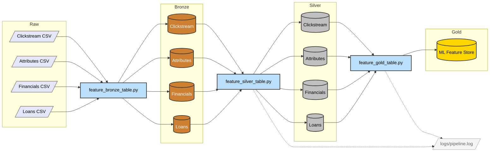

# Pipeline Architecture v3.0 — Medallion Architecture

> Source of truth: [Databricks — What is Medallion Architecture?](https://www.databricks.com/glossary/medallion-architecture)

## Mermaid Diagram

Copy the code block below and paste it into [mermaid.live](https://mermaid.live) to render.

## Layer Definitions (per Databricks)

| Layer | Purpose (Databricks) | Our Processing Steps | Anomalies & Logging |
|-------|---------------------|----------------------|---------------------|
| **Bronze** | Land raw data "as-is" with metadata | ✅ Read 4 CSVs (Clickstream, Attributes, Financials, Loans) | ✅ `ingestion_timestamp` added to every row |
| | | ✅ Add `ingestion_timestamp` column | ✅ Row counts logged per table |
| | | ✅ Write to Parquet (no schema changes) | 🔲 *Backlog: Schema drift detection (alert if CSV columns change)* |
| **Silver** | Cleanse, conform, deduplicate — "Enterprise view" | ✅ Cast `Age` to int, regex-strip garbage chars | ✅ **Age**: 988/12500 (7.9%) anomalies — `WARNING` logged |
| | | ✅ Median-fill Age outliers (outside 18–100) | ✅ **Num_of_Loan**: 563/12500 (4.5%) anomalies — `INFO` logged |
| | | ✅ Median-fill Num_of_Loan outliers (outside 0–50) | ✅ **Annual_Income**: Winsorized at 99th percentile |
| | | ✅ Winsorize Annual_Income at 99th percentile | ✅ Threshold alerting: <1% INFO, >5% WARNING, >20% CRITICAL |
| | | ✅ Regex-clean all financial numeric columns | 🔲 *Backlog: Monitor `Outstanding_Debt` for negative values* |
| | | ✅ Cast `loan_start_date`, `snapshot_date` to Date | 🔲 *Backlog: Monitor `Monthly_Balance` for extreme negatives* |
| | | ✅ Deduplicate by `Customer_ID` + `snapshot_date` | 🔲 *Backlog: Alert on duplicate rate exceeding 1%* |
| **Gold** | Curated, consumption-ready, business-level tables | ✅ Loans table as anchor spine (137,500 events) | ✅ Gold row count logged |
| | | ✅ ASOF join: forward-fill Attributes to loan dates | ✅ Zero data leakage guaranteed (point-in-time) |
| | | ✅ ASOF join: forward-fill Financials to loan dates | 🔲 *Backlog: Alert if Gold row count deviates >10% from Silver Loans* |
| | | ✅ 90-day rolling window aggregation for Clickstream (sum + avg of fe_1 to fe_20) | 🔲 *Backlog: Feature drift monitoring (compare Gold stats across runs)* |
| | | ✅ Derived feature: `Debt_to_Income` ratio | |
| | | ✅ Fill missing clickstream aggregates with 0.0 | |

## Logging Strategy

We use **one combined pipeline log** (`logs/pipeline.log`) rather than separate logs per layer. This is the standard approach because:
- Logging is **infrastructure**, not a data layer — it sits outside the Medallion hierarchy
- A single chronological log makes it easy to trace the full pipeline execution from Bronze through Gold
- Data Quality threshold alerts (INFO/WARNING/CRITICAL) from Silver and Gold processes both write to this same file
